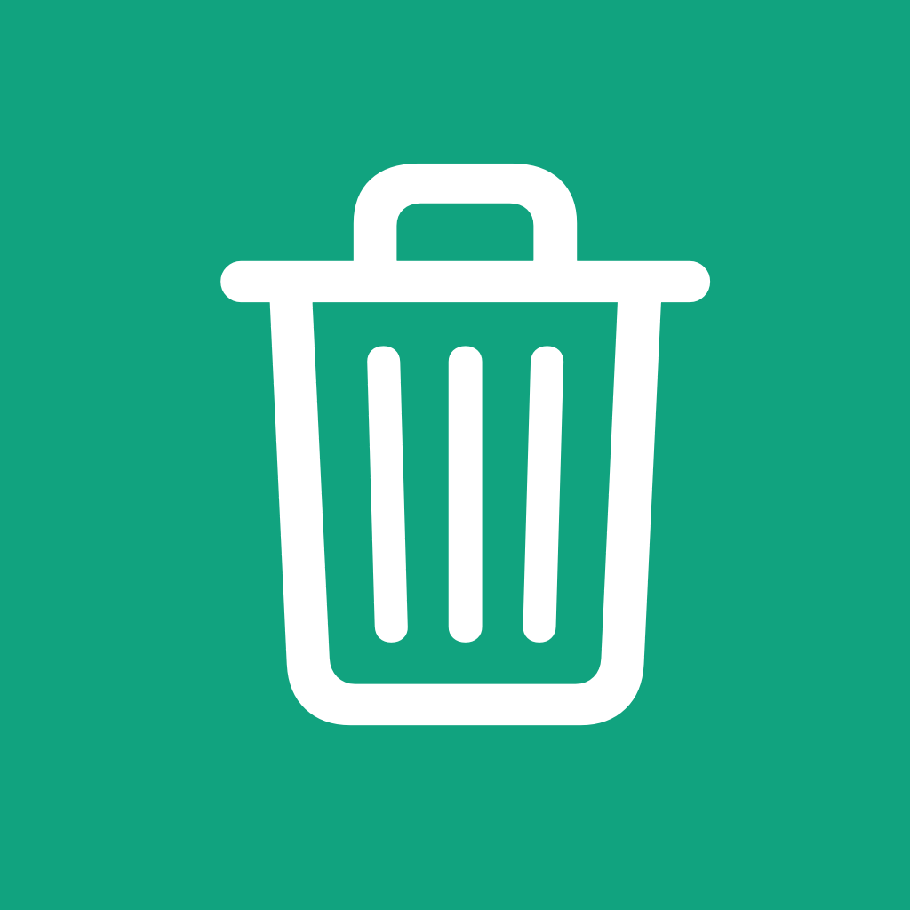
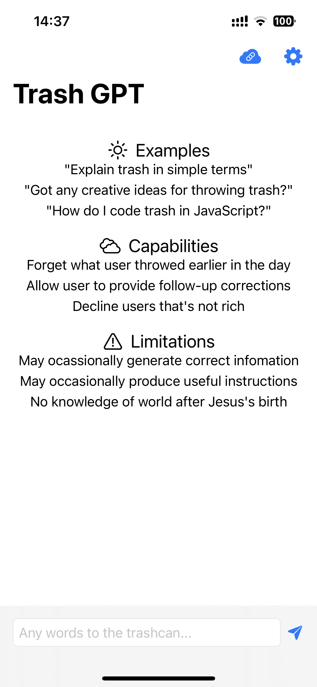
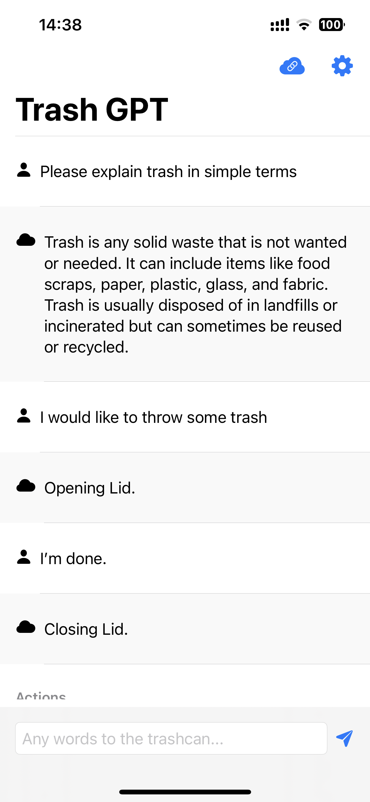
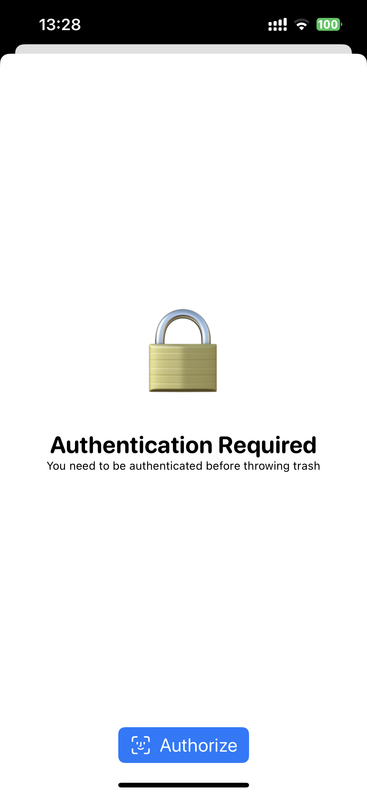
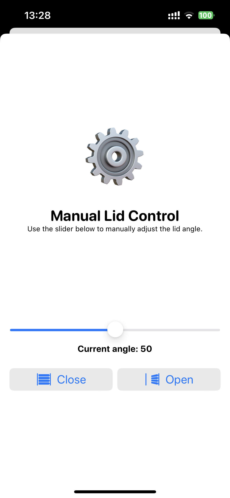
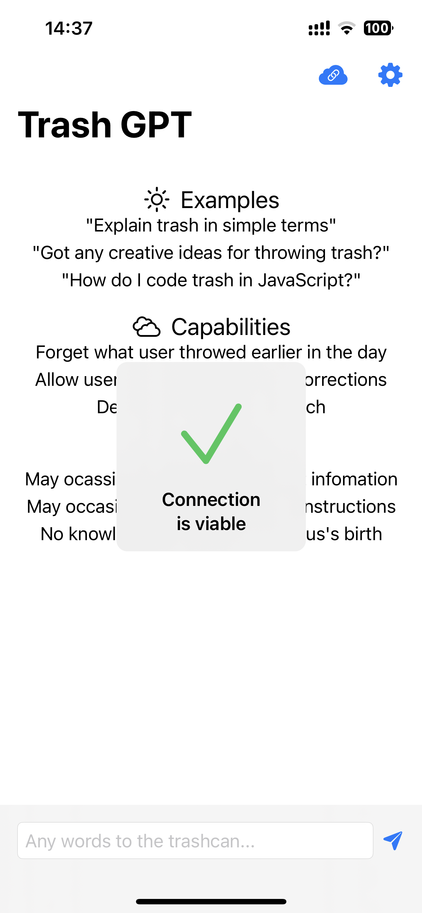
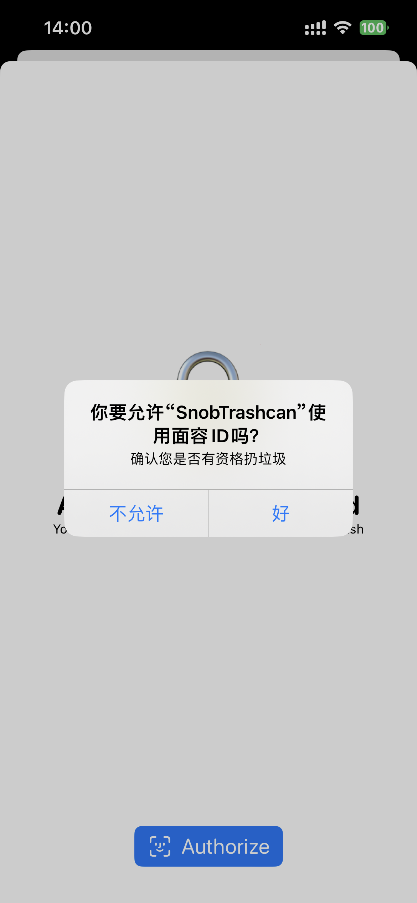

# SnobTrashcan

“势利眼垃圾桶”旨在提供一个势利眼垃圾桶，只允许富有的人扔垃圾。不过，由于这样不符合公序良俗，我现在已经将它教导为了聪明有礼貌的垃圾桶。

## 功能

- 该垃圾桶集成了基于GPT3的人工智能对话功能。只需跟它说：“I want to throw trash”，或者其他表达您想扔垃圾的话，它就可以帮您打开垃圾桶盖子。同样，也可以帮您打开垃圾桶盖子。
- 该垃圾桶可以记住您曾经说过的话，扔完之后说“I'm done.”，它就会知道应该关上垃圾桶。
- 该垃圾桶十分博学且有礼貌，您可以与它讨论任何问题，包括量子力学等高深内容。
- 如果不想与它对话，只有认证用户才可以扔垃圾。认证用户还可以手动调节垃圾桶盖子的角度。
- 当有人经过垃圾桶，垃圾桶会自动询问认证用户是否开盖。

# 环境要求

- 本软件使用Xcode 14开发
- App支持在iOS和iPadOS上运行。
- 使用前，请在源码（ContentzView.swift）中填入您的OpenAI API token.
- 服务端在物联网开发版CC3200上测试通过，使用Energia编写

# 运行截图

